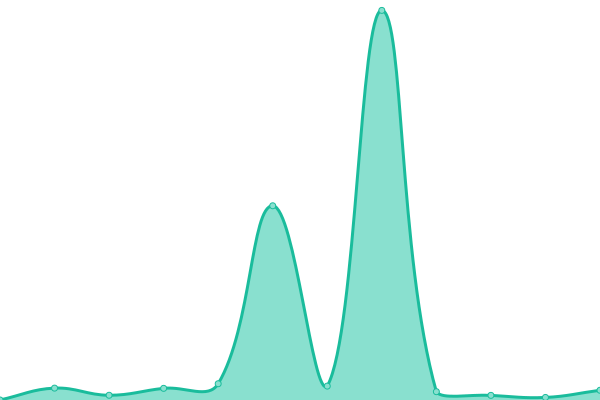

# [📈 Live Status](https://upptime.github.io/upptime): <!--live status--> **🟧 Partial outage**

This repository contains the open-source uptime monitor and status page for [Upptime](https://upptime.js.org), powered by [Upptime](https://github.com/upptime/upptime).

With [Upptime](https://upptime.js.org), you can get your own unlimited and free uptime monitor and status page, powered entirely by a GitHub repository. We use [Issues](https://github.com/upptime/upptime/issues) as incident reports, [Actions](https://github.com/bobbyorg/upptime_org/actions) as uptime monitors, and [Pages](https://upptime.github.io/upptime) for the status page.

<!--start: status pages-->
<!-- This summary is generated by Upptime (https://github.com/upptime/upptime) -->
<!-- Do not edit this manually, your changes will be overwritten -->
<!-- prettier-ignore -->
| URL | Status | History | Response Time | Uptime |
| --- | ------ | ------- | ------------- | ------ |
|  [ORG Website](https://www.orientalremediesgroup.com/) | 🟩 Up | [org-website.yml](https://github.com/bobbyorg/upptime_org/commits/HEAD/history/org-website.yml) | 

 2749ms
     
 | 

<a href="https://bobbyorg.github.io/upptime_org/history/org-website">99.83%</a>
    

|  [VD Login Page](https://hub.vaultdragon.com/login) | 🟩 Up | [vd-login-page.yml](https://github.com/bobbyorg/upptime_org/commits/HEAD/history/vd-login-page.yml) | 

 722ms
     
 | 

<a href="https://bobbyorg.github.io/upptime_org/history/vd-login-page">100.00%</a>
    

|  [SleekFlow](https://app.sleekflow.io/) | 🟩 Up | [sleek-flow.yml](https://github.com/bobbyorg/upptime_org/commits/HEAD/history/sleek-flow.yml) | 

 203ms
     
 | 

<a href="https://bobbyorg.github.io/upptime_org/history/sleek-flow">100.00%</a>
    

|  [SimplyBook](https://orientalremediesgroup.secure.simplybook.asia/v2/index/index) | 🟩 Up | [simply-book.yml](https://github.com/bobbyorg/upptime_org/commits/HEAD/history/simply-book.yml) | 

 1643ms
     
 | 

<a href="https://bobbyorg.github.io/upptime_org/history/simply-book">100.00%</a>
    

|  [SimplyBook VIP](https://orientalremediesgroup.secure.simplybook.vip/v2/index/index) | 🟩 Up | [simply-book-vip.yml](https://github.com/bobbyorg/upptime_org/commits/HEAD/history/simply-book-vip.yml) | 

 1572ms
     
 | 

<a href="https://bobbyorg.github.io/upptime_org/history/simply-book-vip">100.00%</a>
    

|  [SleekFlow API](https://api.sleekflow.io/api/analytic?startDate=2025-01-01&endDate=2025-01-02) | 🟥 Down | [sleek-flow-api.yml](https://github.com/bobbyorg/upptime_org/commits/HEAD/history/sleek-flow-api.yml) | 

 966ms
     
 | 

<a href="https://bobbyorg.github.io/upptime_org/history/sleek-flow-api">0.00%</a>
    

|  SB API | 🟥 Down | [sb-api.yml](https://github.com/bobbyorg/upptime_org/commits/HEAD/history/sb-api.yml) | 

 942ms
     
 | 

<a href="https://bobbyorg.github.io/upptime_org/history/sb-api">0.00%</a>
    

|  [Test Broken Site](https://thissitedoesnotexist.koj.co) | 🟥 Down | [test-broken-site.yml](https://github.com/bobbyorg/upptime_org/commits/HEAD/history/test-broken-site.yml) | 

 0ms
     
 | 

<a href="https://bobbyorg.github.io/upptime_org/history/test-broken-site">100.00%</a>
    

|  [IPv6 test](forwardemail.net) | 🟥 Down | [i-pv6-test.yml](https://github.com/bobbyorg/upptime_org/commits/HEAD/history/i-pv6-test.yml) | 

 0ms
     
 | 

<a href="https://bobbyorg.github.io/upptime_org/history/i-pv6-test">100.00%</a>
    

<!--end: status pages-->

[**Visit our status website →**](https://upptime.github.io/upptime)

## 📄 License

- Powered by: [Upptime](https://github.com/upptime/upptime)
- Code: [MIT](./LICENSE) © [Anand Chowdhary](https://anandchowdhary.com), supported by [Pabio](https://pabio.com)
- Data in the `./history` directory: [Open Database License](https://opendatacommons.org/licenses/odbl/1-0/)
